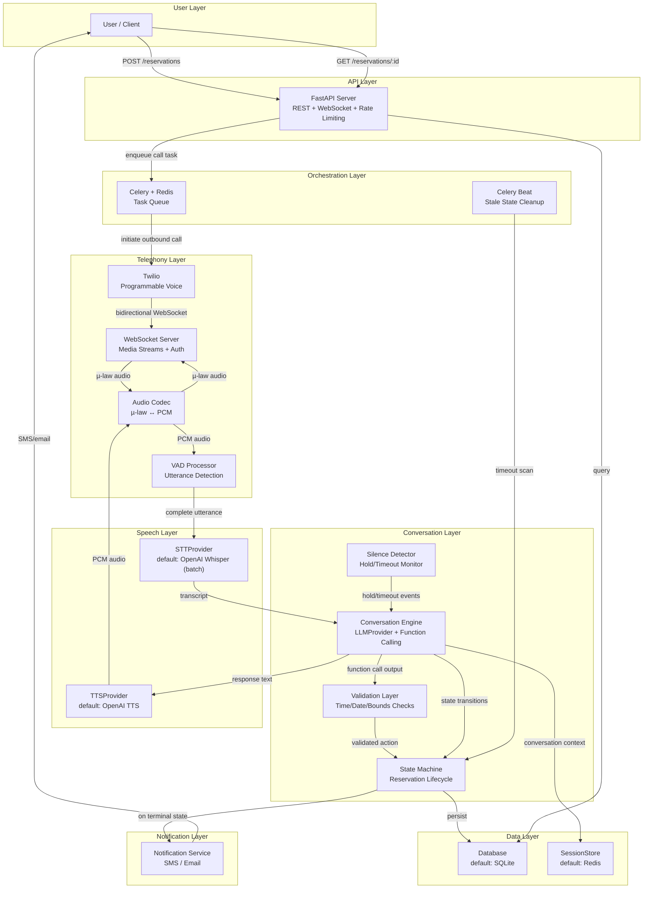
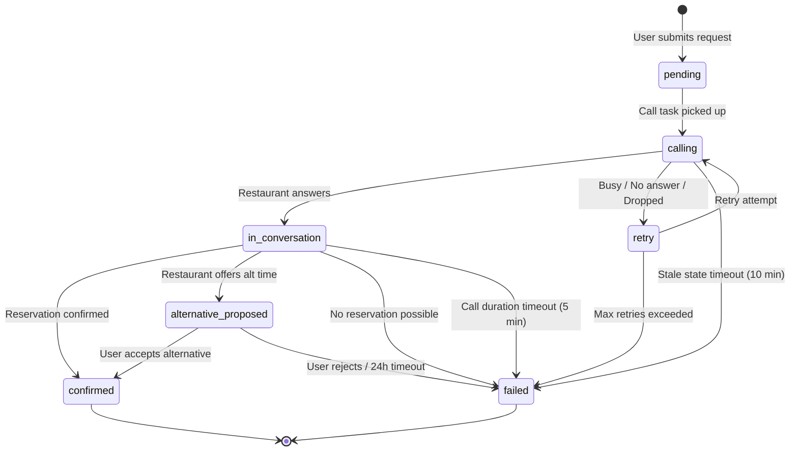

# Restaurant Reservation Agent — Architecture Design (v2)

> [!NOTE]
> **v2** incorporates all resolutions from the [architecture critique](file:///home/etem/reservation-agent/Implementation%20Plan/architecture_critique.md). Changes are marked with 🔧 tags linking to the original critique item.

## Problem Statement

Build an AI agent that:
1. Accepts reservation requests from users (restaurant name, phone, date, time, party size, flexibility)
2. Places outbound phone calls to restaurants and conducts natural voice conversations to book tables
3. Negotiates alternative times within user-defined bounds when the preferred slot is unavailable
4. Notifies users of outcomes (confirmed, alternative proposed, failed)

---

## Design Decisions & Rationale

### Decision 1: Chained Pipeline (STT → LLM → TTS) over WebSocket Media Streams

> [!IMPORTANT]
> We use the **chained pipeline** (STT → LLM → TTS) delivered over **Twilio bidirectional Media Streams** (WebSockets). We do NOT use the older `<Gather>` webhook-per-turn model or the newer GPT-4o Realtime speech-to-speech API.

**Alternatives considered:**

| Aspect | Chained Pipeline (ASR → LLM → TTS) | Speech-to-Speech (GPT-4o Realtime) | `<Gather>` Webhook Model |
|--------|-------------------------------------|-------------------------------------|--------------------------|
| Latency | ~1.5-3s per turn | ~0.5-1s per turn | ~3-5s per turn (HTTP round-trip) |
| Control | Full — transcript available, function calling on text | Limited — audio in/out, less inspectable | Full but slow — one webhook per utterance |
| Cost | Lower (separate cheaper models) | Higher (single expensive model) | Lowest but worst UX |
| Debuggability | High — text transcript at every stage | Low — opaque audio pipeline | High but fragmented |
| Transcript logging | Built-in (text is the primary medium) | Requires separate transcription | Built-in via `SpeechResult` |
| Maturity | Production-proven | Still evolving | Legacy, being deprecated |
| Negotiation logic | Precise — structured function calls on text | Harder to constrain | Precise but slow |
| Real-time feel | Good — WebSocket enables sub-second audio | Best — native audio model | Poor — noticeable HTTP gaps |

**Why chained pipeline wins:**

1. **Transcript visibility is non-negotiable.** The agent acts on the user's behalf. Every word said must be logged and auditable. The chained pipeline produces text as its primary medium — transcripts are a natural byproduct, not an afterthought.

2. **Function calling precision matters for negotiation.** When the restaurant says "we can do 8:15 instead," the LLM must produce a structured `propose_alternative(time="20:15")` call — not a free-form audio response. Function calling on text is mature, well-documented, and testable. Function calling on audio (GPT-4o Realtime) is still experimental and harder to constrain.

3. **Debuggability saves development time.** When something goes wrong in a phone call, we need to answer: "What did the restaurant say? What did the LLM decide? Why?" With a chained pipeline, every stage has inspectable text output. With speech-to-speech, we'd have to reverse-engineer from audio.

4. **Cost predictability.** GPT-4o Realtime pricing is significantly higher and less predictable (charged per audio minute, not per token). For a system that may make many calls per day, cost control matters.

**Why NOT `<Gather>` webhooks:**

The older `<Gather>` model requires a full HTTP round-trip per utterance. Twilio sends a webhook with `SpeechResult`, waits for a TwiML response, then plays it back. This adds 3-5s of perceived latency per turn — unacceptable for natural conversation. Restaurant staff will assume the line is dead and hang up.

**Why WebSocket Media Streams:**

`<Connect><Stream>` opens a persistent bidirectional WebSocket between Twilio and our server. Audio flows continuously in both directions. This eliminates the HTTP round-trip latency of `<Gather>` while keeping full control over the pipeline. It's the best of both worlds: real-time audio + inspectable text at every stage.

---

### Decision 2: All-OpenAI Default Providers

> [!IMPORTANT]
> Default providers are all-OpenAI: Whisper (STT) + GPT-4o (LLM) + TTS. Single SDK, single API key, single billing account.

**Alternatives considered:**

| Component | Option A (Chosen) | Option B | Option C |
|-----------|-------------------|----------|----------|
| STT | OpenAI Whisper API | Deepgram Nova-2 | faster-whisper (on-device) |
| TTS | OpenAI TTS API | ElevenLabs Turbo v2.5 | Kokoro (on-device) |
| LLM | OpenAI GPT-4o | Anthropic Claude | Local LLM |

**Why all-OpenAI:**

1. **Minimal dependency surface.** One SDK (`openai`), one API key, one billing dashboard, one set of rate limits to understand. Adding Deepgram for STT and ElevenLabs for TTS would mean 3 SDKs, 3 API keys, 3 billing accounts, 3 sets of documentation, 3 points of failure.

2. **Reduced operational complexity.** When debugging a failed call: "Was it the Deepgram connection? The ElevenLabs rate limit? The OpenAI timeout?" becomes "Was it the OpenAI API?" One provider to monitor, one set of status pages to check.

3. **Good enough quality.** Whisper is excellent for STT (state-of-the-art accuracy). OpenAI TTS is decent (not as natural as ElevenLabs, but sufficient for a professional booking call). GPT-4o is best-in-class for function calling.

4. **Cost consolidation.** Single invoice. Easier to track, budget, and optimize.

**Why not best-in-class per component:**

Deepgram Nova-2 is better for phone audio (native 8kHz µ-law support, no resampling). ElevenLabs sounds more natural. But the complexity cost of 3 providers outweighs the marginal quality improvement for an MVP. The provider abstraction lets us swap later if quality issues surface.

**Why not on-device:**

faster-whisper + Kokoro would eliminate all cloud dependencies (except LLM). But they require a GPU, add 2GB+ of model dependencies, need warm-up time, and introduce audio resampling complexity (8kHz µ-law → 16kHz PCM for Whisper). Operational burden is significantly higher. Again — swappable later via provider abstraction.

> [!NOTE]
> 🔧 **Builder critique: Whisper is batch-only, not streaming.** OpenAI's Whisper API is a batch endpoint — you upload a complete audio file, not a real-time stream. The STT interface is designed for **VAD-chunked batch processing**: accumulate audio until end-of-utterance is detected (via Voice Activity Detection), then transcribe the complete utterance. This fits our turn-based conversation model. See [Decision 6](#decision-6-vad-chunked-stt-not-true-streaming) for details.

---

### Decision 3: Provider Abstraction for All External Dependencies

> [!IMPORTANT]
> **Every external dependency is abstracted behind a provider interface.** Default providers can be swapped without touching business logic. This is a core architectural constraint, not an optional pattern.

**Why this matters:**

1. **Future-proofing.** AI models and APIs evolve fast. A better STT provider may emerge next month. Swapping should be a config change, not a refactor.

2. **Testing.** Mock providers enable unit testing without API calls, network dependencies, or credentials. The `ConversationEngine` can be tested with a mock `LLMProvider` that returns deterministic responses.

3. **Cost optimization.** Start with cloud OpenAI, move to on-device models later to eliminate per-call API costs. The business logic doesn't change.

4. **Environment flexibility.** Development: mock providers (fast, free). Staging: OpenAI (real but cheap). Production: potentially mixed (Deepgram STT for accuracy, OpenAI LLM, ElevenLabs TTS for voice quality).

**Swappable components:**

| Component | Interface | Default Provider | Swappable To |
|-----------|-----------|-----------------|--------------|
| STT | `STTProvider` | OpenAI Whisper API | Deepgram, faster-whisper (on-device) |
| TTS | `TTSProvider` | OpenAI TTS API | ElevenLabs, Kokoro (on-device) |
| LLM | `LLMProvider` | OpenAI GPT-4o | Anthropic Claude, local LLM |
| Session Store | `SessionStore` | Redis | In-memory dict, SQLite |
| Database | `Database` | SQLite | PostgreSQL, Redis |

### Provider Interface Pattern

🔧 **Builder critique resolved:** STT interface redesigned for VAD-chunked batch model instead of false streaming abstraction.

```python
from abc import ABC, abstractmethod
from typing import AsyncIterator

class STTProvider(ABC):
    """Transcribes a complete utterance (post-VAD). NOT a streaming interface."""
    @abstractmethod
    async def transcribe(self, audio: bytes, format: str = "wav") -> TranscriptResult: ...

class TTSProvider(ABC):
    """Synthesizes speech from text. Returns audio chunks for streaming playback."""
    @abstractmethod
    async def synthesize(self, text: str, output_format: str = "pcm") -> AsyncIterator[bytes]: ...

class LLMProvider(ABC):
    @abstractmethod
    async def chat(self, messages: list[dict], functions: list[dict] | None = None) -> LLMResponse: ...

class SessionStore(ABC):
    @abstractmethod
    async def get(self, key: str) -> dict | None: ...
    @abstractmethod
    async def set(self, key: str, value: dict, ttl: int | None = None) -> None: ...
    @abstractmethod
    async def delete(self, key: str) -> None: ...

class Database(ABC):
    @abstractmethod
    async def create_reservation(self, reservation: Reservation) -> None: ...
    @abstractmethod
    async def get_reservation(self, reservation_id: str) -> Reservation | None: ...
    @abstractmethod
    async def update_reservation(self, reservation_id: str, **fields) -> None: ...
    @abstractmethod
    async def log_state_transition(self, transition: StateTransition) -> None: ...
    @abstractmethod
    async def log_call(self, call_log: CallLog) -> None: ...
    @abstractmethod
    async def append_transcript_turn(self, reservation_id: str, turn: TranscriptTurn) -> None: ...
    @abstractmethod
    async def get_transcript(self, reservation_id: str) -> list[TranscriptTurn]: ...
```

### Provider Registration

```python
# configs/providers.py — single place to swap providers
from src.providers.openai_stt import OpenAISTT
from src.providers.openai_tts import OpenAITTS
from src.providers.openai_llm import OpenAILLM
from src.providers.redis_session import RedisSessionStore
from src.providers.sqlite_db import SQLiteDatabase

def create_providers() -> dict:
    return {
        "stt": OpenAISTT(),
        "tts": OpenAITTS(),
        "llm": OpenAILLM(),
        "session": RedisSessionStore(),
        "db": SQLiteDatabase(),
    }
```

---

### Decision 4: Redis + SQLite (Dual Data Store)

**Why not just one?**

Redis and SQLite serve fundamentally different purposes:

| Concern | Redis | SQLite |
|---------|-------|--------|
| Data type | Ephemeral, fast-access | Durable, structured |
| Durability | In-memory (AOF/RDB possible but not primary) | ACID-compliant file on disk |
| Query model | Key-value lookup | Full SQL |
| Use case | Live session state, distributed locks, task broker | Reservation records, transcripts, audit logs |
| Loss impact | Low — sessions die when calls end | Critical — user's confirmed booking |

**Why Redis:**
- Celery needs a message broker — Redis is the standard choice
- Live call sessions need sub-millisecond reads (conversation context grows with each turn)
- Distributed locks prevent concurrent state transitions on the same reservation
- TTL-based expiry cleans up dead sessions automatically

**Why SQLite:**
- Reservation records are permanent business data — ACID durability is essential
- Transcripts are legal/audit artifacts — cannot be lost to a Redis restart
- State transition logs need structured queries for debugging ("show me all transitions for reservation X")
- Zero operational overhead — no server, no config, single file, built into Python

**Why not Redis-only:**
- Redis persistence (AOF/RDB) is a bolt-on, not a core guarantee. Power failure can lose recent writes.
- No SQL means no complex queries for reporting, debugging, or audit.
- Keeping all data in RAM is wasteful for cold data (old transcripts, completed reservations).

**Why not SQLite-only:**
- SQLite is single-writer — concurrent Celery workers would contend on the write lock.
- No native TTL — expired sessions would require manual cleanup jobs.
- Higher latency for the hot-path reads needed during live calls.

---

### Decision 5: LLM Function Calling for Structured Decisions

**Why not free-form text responses?**

The LLM must make structured decisions during the call: confirm a time, propose an alternative, request a hold, or end the call. Free-form text responses would require parsing and regex extraction of times, dates, and intents — fragile and error-prone.

Function calling forces the LLM to output structured JSON with validated fields. The server can then enforce constraints (e.g., `proposed_time` must be within user's flexibility window) before acting.

**Why these specific functions:**

```python
RESERVATION_FUNCTIONS = [
    "confirm_reservation"    # Happy path: restaurant confirms
    "propose_alternative"    # Negotiation: restaurant offers different time
    "request_hold"           # Pause: restaurant needs to check availability
    "end_call"               # Terminal: no reservation possible
]
```

These four functions cover the complete decision space for a reservation call:
- Every natural conversation turn maps to exactly one of these actions
- There is no "ambiguous" state — the LLM must commit to a structured action
- Server-side validation can reject invalid actions (e.g., `propose_alternative` with a time outside bounds)
- The state machine knows exactly what happened and can transition accordingly

🔧 **Shield critique resolved:** All function call outputs are validated server-side before state transitions. See [Validation Layer](#validation-layer) below.

---

### Decision 6: VAD-Chunked STT, Not True Streaming

🔧 **Builder critique: Whisper API is batch-only.**

OpenAI's Whisper API accepts a complete audio file and returns a transcript. It does NOT support real-time WebSocket streaming. This means we need Voice Activity Detection (VAD) to buffer audio into complete utterances before sending to Whisper.

**How it works:**

```
Twilio Audio Stream (continuous) → VAD (detect speech boundaries) → Buffer full utterance → Whisper API (batch) → Transcript
```

**VAD approach:**

```python
class VADProcessor:
    """Buffers audio chunks, detects end-of-speech, yields complete utterances."""

    def __init__(self, silence_threshold_ms: int = 700, min_speech_ms: int = 300):
        self.buffer: bytearray = bytearray()
        self.silence_threshold_ms = silence_threshold_ms  # Silence after speech = end of utterance
        self.min_speech_ms = min_speech_ms                # Minimum speech to avoid noise triggers

    async def process_chunk(self, audio_chunk: bytes) -> bytes | None:
        """Returns complete utterance audio when end-of-speech detected, else None."""
        self.buffer.extend(audio_chunk)
        if self._detect_end_of_speech():
            utterance = bytes(self.buffer)
            self.buffer.clear()
            return utterance
        return None
```

**Why this is acceptable:**
- Our conversation is turn-based — the restaurant speaks, then the agent speaks. VAD naturally segments at turn boundaries.
- Added latency (~0.7s after speaker stops) is within acceptable range for phone conversation.
- If we later swap to Deepgram (true streaming STT), the `STTProvider.transcribe()` interface still works — Deepgram just returns faster.

---

## System Architecture



---

## Component Breakdown

### 1. API Layer (`src/api/`)

**Purpose:** User-facing REST API for reservation management.

| Method | Path | Description |
|--------|------|-------------|
| `POST` | `/reservations` | Submit new reservation request |
| `GET` | `/reservations/{id}` | Check reservation status |
| `GET` | `/reservations/{id}/transcript` | Retrieve call transcript |
| `POST` | `/reservations/{id}/confirm-alternative` | User confirms proposed alternative |
| `POST` | `/reservations/{id}/cancel` | Cancel pending reservation |
| `POST` | `/webhooks/twilio/status` | Twilio call status callback (with signature validation) |
| `WebSocket` | `/ws/media-stream/{reservation_id}?token={auth_token}` | Twilio bidirectional media stream |
| `GET` | `/health` | Liveness check — server is up |
| `GET` | `/readiness` | Dependency check — Redis, Twilio reachable |

🔧 **Shield critiques resolved:**
- WebSocket URL uses `reservation_id` (not `call_sid`) + short-lived auth `token` generated at `calls.create()` time
- Rate limiting middleware added (see below)
- `/health` and `/readiness` endpoints added

#### Rate Limiting

```python
# Middleware: per-user rate limits
RATE_LIMITS = {
    "POST /reservations": "5/minute",
    "GET /reservations/{id}": "30/minute",
    "POST /reservations/{id}/confirm-alternative": "5/minute",
    "global": "100/minute",
}
```

#### Key schemas

```python
class ReservationRequest(BaseModel):
    restaurant_name: str
    restaurant_phone: str           # E.164 format
    date: date                      # Must be future
    preferred_time: time
    alt_time_window: TimeWindow | None  # Negotiation bounds (see below)
    party_size: int                 # 1-20
    special_requests: str | None
    user_contact: UserContact       # phone + email for notifications

class TimeWindow(BaseModel):
    """Single contiguous range. None means 'preferred time only, no alternatives.'"""
    start: time
    end: time

    @model_validator(mode="after")
    def validate_range(self):
        if self.start >= self.end:
            raise ValueError("alt_time_window.start must be before end")
        return self

class ReservationResponse(BaseModel):
    reservation_id: UUID
    status: ReservationStatus
    confirmed_time: time | None
    call_attempts: int
    transcript: list[TranscriptTurn] | None
```

🔧 **Architect critique resolved:** `alt_time_window` semantics are now explicit:
- `None` = preferred time only, no alternatives accepted
- `TimeWindow(start, end)` = single contiguous range on the same date
- Multi-range or different-date flexibility is out of scope for v1

---

### 2. Orchestration Layer (`src/tasks/`)

**Purpose:** Async call execution with retry logic.

```python
@celery_app.task(bind=True, max_retries=3, default_retry_delay=60)
def place_reservation_call(self, reservation_id: str):
    """
    1. Load reservation from DB
    2. Validate still in 'pending' or 'retry' state
    3. Generate short-lived WebSocket auth token, store in Redis
    4. Initiate Twilio outbound call with Media Stream URL + token
    5. Update state to 'calling'
    6. On failure/timeout → retry with exponential backoff
    """
```

**Retry policy:**
- Attempt 1: immediate
- Attempt 2: after 60s
- Attempt 3: after 120s
- After 3 failures: set status to `failed`, notify user

**Why exponential backoff:** Restaurants may be briefly busy. Hammering them with immediate retries is rude and unlikely to succeed. 60s → 120s gives time for lines to clear.

**Why max 3 attempts:** Diminishing returns. If a restaurant doesn't answer 3 times, they're likely closed, too busy, or the number is wrong. Better to notify the user and let them decide.

#### Process Model

🔧 **Builder critique resolved:** Explicit process architecture.

```
Process A: FastAPI (uvicorn)
    - REST API endpoints
    - WebSocket media stream handler
    - Serves on port 8000

Process B: Celery Worker
    - Picks up call tasks from Redis broker
    - Calls twilio_client.calls.create()
    - Has its own Twilio client instance
    - Reports results via DB writes + Redis session updates

Process C: Celery Beat (scheduler)
    - Runs periodic stale-state cleanup task
    - Runs periodic transcript flush task

All 3 processes: same codebase, same configs, connect to same Redis + SQLite.
Start command: scripts/run_server.py starts all 3.
```

#### Stale State Cleanup (Celery Beat)

🔧 **Shield critique resolved:** Time-based state transitions.

```python
@celery_app.task
def cleanup_stale_reservations():
    """Runs every 5 minutes via Celery Beat."""
    now = utcnow()
    # Reservations stuck in 'calling' for > 10 min → retry or failed
    stale_calling = db.get_reservations_by_status("calling", older_than=now - 10min)
    for r in stale_calling:
        state_machine.transition(r.id, "retry" if r.call_attempts < 3 else "failed")

    # Reservations in 'alternative_proposed' for > 24 hours → failed
    stale_alt = db.get_reservations_by_status("alternative_proposed", older_than=now - 24h)
    for r in stale_alt:
        state_machine.transition(r.id, "failed", trigger="user_timeout")
        notify(r, "Your alternative time offer has expired.")
```

---

### 3. Telephony Layer (`src/telephony/`)

**Purpose:** Twilio integration — outbound calls, status callbacks, media stream management.

#### Call initiation flow

🔧 **Architect + Builder + Shield critiques resolved:** Voicemail detection, auth token, TwiML via SDK, call timeout.

```python
import secrets
from twilio.twiml.voice_response import VoiceResponse, Connect, Stream

def initiate_call(reservation: Reservation, session_store: SessionStore) -> str:
    # Generate short-lived auth token for WebSocket
    auth_token = secrets.token_urlsafe(32)
    await session_store.set(
        f"ws_token:{reservation.reservation_id}",
        {"token": auth_token},
        ttl=60  # Token valid for 60 seconds
    )

    response = VoiceResponse()
    connect = Connect()
    stream = Stream(
        url=f"wss://{HOST}/ws/media-stream/{reservation.reservation_id}?token={auth_token}"
    )
    connect.append(stream)
    response.append(connect)

    call = twilio_client.calls.create(
        to=reservation.restaurant_phone,
        from_=TWILIO_PHONE_NUMBER,
        twiml=str(response),
        timeout=30,                   # Ring timeout: 30s before no-answer
        time_limit=300,               # Hard cap: 5 minutes (🔧 Shield critique)
        machine_detection="Enable",   # Voicemail detection (🔧 Architect critique)
        status_callback=f"{HOST}/webhooks/twilio/status",
        status_callback_event=["initiated", "ringing", "answered", "completed"],
    )
    return call.sid
```

#### Audio Codec Layer

🔧 **Architect critique resolved:** Explicit µ-law ↔ PCM conversion.

```python
# src/telephony/audio_codec.py
import audioop

class AudioCodec:
    """Converts between Twilio's µ-law 8kHz and PCM formats."""

    @staticmethod
    def mulaw_to_pcm(mulaw_bytes: bytes) -> bytes:
        """Convert 8-bit µ-law to 16-bit PCM."""
        return audioop.ulaw2lin(mulaw_bytes, 2)  # 2 = 16-bit samples

    @staticmethod
    def pcm_to_mulaw(pcm_bytes: bytes) -> bytes:
        """Convert 16-bit PCM to 8-bit µ-law."""
        return audioop.lin2ulaw(pcm_bytes, 2)

    @staticmethod
    def resample_8k_to_16k(pcm_8k: bytes) -> bytes:
        """Resample 8kHz PCM to 16kHz for Whisper."""
        return audioop.ratecv(pcm_8k, 2, 1, 8000, 16000, None)[0]

    @staticmethod
    def resample_16k_to_8k(pcm_16k: bytes) -> bytes:
        """Resample 16kHz PCM back to 8kHz for Twilio."""
        return audioop.ratecv(pcm_16k, 2, 1, 16000, 8000, None)[0]
```

#### Media stream WebSocket handler

🔧 **Multiple critiques resolved:** Auth token validation, greeting trigger, call timeout watchdog, silence detection, structured cleanup.

```python
async def handle_media_stream(websocket, reservation_id, providers):
    # 1. Authenticate WebSocket connection
    token = websocket.query_params.get("token")
    stored = await providers["session"].get(f"ws_token:{reservation_id}")
    if not stored or stored["token"] != token:
        await websocket.close(code=4001, reason="Invalid token")
        return
    await providers["session"].delete(f"ws_token:{reservation_id}")  # Single-use token

    # 2. Initialize components
    codec = AudioCodec()
    vad = VADProcessor(silence_threshold_ms=700)
    silence_detector = SilenceDetector(hold_timeout_s=30, max_silence_s=120)
    conversation = ConversationEngine(reservation_id, providers)
    stream_sid = None

    try:
        async with asyncio.timeout(300):  # 5-minute hard watchdog
            async for message in websocket:
                event = json.loads(message)

                if event["event"] == "start":
                    stream_sid = event["start"]["streamSid"]
                    # 🔧 Architect critique: deliver opening greeting
                    greeting = await conversation.get_greeting()
                    await _send_speech(websocket, stream_sid, greeting, providers["tts"], codec)

                elif event["event"] == "media":
                    audio_mulaw = base64.b64decode(event["media"]["payload"])
                    audio_pcm = codec.mulaw_to_pcm(audio_mulaw)

                    # Track silence / hold
                    silence_event = silence_detector.process(audio_pcm)
                    if silence_event == "prompt_check":
                        await _send_speech(websocket, stream_sid, "Hello, are you still there?", providers["tts"], codec)
                        continue
                    elif silence_event == "timeout":
                        await conversation.handle_action(Action("end_call", reason="Extended hold timeout"))
                        break

                    # VAD: buffer until end-of-utterance
                    audio_16k = codec.resample_8k_to_16k(audio_pcm)
                    utterance = await vad.process_chunk(audio_16k)

                    if utterance:
                        # Batch transcribe complete utterance
                        transcript = await providers["stt"].transcribe(utterance)
                        if transcript and transcript.text.strip():
                            response = await conversation.process(transcript.text)
                            await _send_speech(websocket, stream_sid, response.speech_text, providers["tts"], codec)
                            await conversation.handle_action(response)

                elif event["event"] == "stop":
                    break

    except asyncio.TimeoutError:
        await conversation.handle_action(Action("end_call", reason="Call duration exceeded"))
    finally:
        # 🔧 Shield critique: always persist transcript on exit
        await conversation.finalize()

async def _send_speech(websocket, stream_sid, text, tts, codec):
    """Synthesize text and send audio back to Twilio."""
    async for audio_pcm in tts.synthesize(text):
        audio_8k = codec.resample_16k_to_8k(audio_pcm)
        audio_mulaw = codec.pcm_to_mulaw(audio_8k)
        await websocket.send(json.dumps({
            "event": "media",
            "streamSid": stream_sid,
            "media": {"payload": base64.b64encode(audio_mulaw).decode()}
        }))
```

---

### 4. Conversation Engine (`src/conversation/`)

**Purpose:** LLM-driven dialogue management with structured decision-making.

#### LLM function calling schema

```python
RESERVATION_FUNCTIONS = [
    {
        "name": "confirm_reservation",
        "description": "Restaurant confirms the reservation at the requested or proposed time",
        "parameters": {
            "confirmed_time": {"type": "string", "description": "24-hour HH:MM format (e.g. 19:30)"},
            "confirmed_date": {"type": "string", "description": "ISO format YYYY-MM-DD"},
            "special_notes": {"type": "string", "description": "Any notes from restaurant"},
        }
    },
    {
        "name": "propose_alternative",
        "description": "Restaurant offers an alternative time. Only call if within user's flexibility window.",
        "parameters": {
            "proposed_time": {"type": "string", "description": "24-hour HH:MM format (e.g. 20:15)"},
            "reason": {"type": "string", "description": "Why original time unavailable"},
        }
    },
    {
        "name": "request_hold",
        "description": "Restaurant asks to hold or check availability. Agent should wait.",
        "parameters": {
            "hold_reason": {"type": "string"},
        }
    },
    {
        "name": "end_call",
        "description": "No reservation possible. End the call politely.",
        "parameters": {
            "reason": {"type": "string", "description": "Why booking failed"},
        }
    },
]
```

#### Validation Layer

🔧 **Shield critique resolved:** All function call outputs are validated before state transitions.

```python
# src/conversation/validators.py
from datetime import time, date, datetime

def parse_time_strict(raw: str) -> time:
    """Parse HH:MM 24-hour format only. Raises ValueError on anything else."""
    try:
        return datetime.strptime(raw.strip(), "%H:%M").time()
    except ValueError:
        raise ValueError(f"Invalid time format: '{raw}'. Expected HH:MM (24-hour).")

def parse_date_strict(raw: str) -> date:
    """Parse YYYY-MM-DD only. Raises ValueError on anything else."""
    try:
        return datetime.strptime(raw.strip(), "%Y-%m-%d").date()
    except ValueError:
        raise ValueError(f"Invalid date format: '{raw}'. Expected YYYY-MM-DD.")

def validate_proposed_time(proposed: time, window: TimeWindow | None) -> bool:
    """Check if proposed time is within user's flexibility window."""
    if window is None:
        return False  # No alternatives accepted
    return window.start <= proposed <= window.end

def validate_confirmed_date(confirmed: date, expected: date) -> bool:
    """Confirmed date must match the reservation date."""
    return confirmed == expected
```

**Validation enforcement in the engine:**

```python
async def handle_action(self, response: LLMResponse):
    if response.action == "confirm_reservation":
        confirmed_time = parse_time_strict(response.params["confirmed_time"])
        confirmed_date = parse_date_strict(response.params["confirmed_date"])
        if not validate_confirmed_date(confirmed_date, self.reservation.date):
            # Date mismatch — re-prompt LLM
            await self._reprompt("The date you confirmed doesn't match. Please verify.")
            return
        # ... proceed with state transition

    elif response.action == "propose_alternative":
        proposed_time = parse_time_strict(response.params["proposed_time"])
        if not validate_proposed_time(proposed_time, self.reservation.alt_time_window):
            # Outside bounds — agent should reject
            await self._reprompt("That time is outside the acceptable range. Please decline politely.")
            return
        # ... proceed with state transition
```

#### System prompt structure

```
You are a polite, professional booking assistant calling on behalf of {user_name}.
You are calling {restaurant_name} to make a reservation.

RESERVATION DETAILS:
- Date: {date}
- Preferred time: {preferred_time}
- Party size: {party_size}
- Special requests: {special_requests}

NEGOTIATION BOUNDS:
- You may accept alternative times between {alt_start} and {alt_end}
- You may NOT change the party size or date
- If no acceptable time is available, end the call politely
- All times must be in 24-hour HH:MM format (e.g., 19:30, not 7:30 PM)
- All dates must be in YYYY-MM-DD format

BEHAVIOR RULES:
- Identify yourself: "Hi, I'm calling to make a reservation on behalf of a guest."
- Be concise — restaurant staff are busy
- Always confirm details before ending: repeat date, time, party size, name
- If asked to hold, wait patiently (the system will handle hold detection)
- If transferred, re-introduce yourself
- If you reach voicemail, use end_call with reason "voicemail"

DISCLOSURE (required): Mention that you are an automated booking assistant.
```

#### Conversation context management

- Maintain rolling transcript in Redis (via `SessionStore`), keyed by `call_sid`
- **Also write each turn to SQLite** via `Database.append_transcript_turn()` for durability (🔧 Shield critique)
- Context window: last 20 turns (or ~2000 tokens) — summarize older turns
- Each turn: `{ role: "restaurant" | "agent", text: str, timestamp: float }`

---

### 5. State Machine (`src/conversation/state_machine.py`)



🔧 **Shield critique resolved:** Added timeout transitions:
- `calling` → `failed` after 10 minutes (via Celery Beat cleanup)
- `in_conversation` → `failed` on call duration timeout (5 min watchdog)
- `alternative_proposed` → `failed` after 24 hours (via Celery Beat cleanup)

**Transition rules:**
- All transitions are atomic (DB write in single transaction)
- Invalid transitions raise `InvalidStateTransition` exception
- Every transition logs: `from_state`, `to_state`, `trigger`, `timestamp`, `call_sid`
- Terminal states (`confirmed`, `failed`) trigger notification

**Why `alternative_proposed` is a separate state:**
When the restaurant offers an alternative time, we need user consent before confirming. The agent cannot accept on the user's behalf beyond their stated flexibility window. This state parks the reservation until the user responds (via SMS/email confirmation).

---

### 6. Notification Layer (`src/notifications/`)

**Purpose:** Notify user of reservation outcomes.

| Event | Channel | Content |
|-------|---------|---------|
| Confirmed | SMS + Email | "Your reservation at {restaurant} is confirmed for {date} at {time}, party of {size}." |
| Alternative proposed | SMS + Email | "Alternative offered: {date} at {alt_time}. Reply CONFIRM or REJECT within 24 hours." |
| Failed | SMS + Email | "Unable to book at {restaurant}. Reason: {reason}. Transcript available at {link}." |
| Max retries | SMS + Email | "Could not reach {restaurant} after 3 attempts." |
| Alt timeout | SMS + Email | "Your alternative time offer has expired." |

---

## Data Layer

### SQLite Schema

🔧 **Architect critique resolved:** Added structured `transcript_turns` table instead of single text blob.

```sql
CREATE TABLE reservations (
    reservation_id TEXT PRIMARY KEY,
    user_id TEXT NOT NULL,
    restaurant_name TEXT NOT NULL,
    restaurant_phone TEXT NOT NULL,
    date TEXT NOT NULL,
    preferred_time TEXT NOT NULL,
    alt_time_start TEXT,
    alt_time_end TEXT,
    party_size INTEGER NOT NULL CHECK(party_size BETWEEN 1 AND 20),
    special_requests TEXT,
    status TEXT NOT NULL DEFAULT 'pending',
    call_attempts INTEGER NOT NULL DEFAULT 0,
    call_sid TEXT,
    confirmed_time TEXT,
    created_at TEXT NOT NULL,
    updated_at TEXT NOT NULL
);

CREATE TABLE transcript_turns (
    id INTEGER PRIMARY KEY AUTOINCREMENT,
    reservation_id TEXT NOT NULL REFERENCES reservations(reservation_id),
    call_sid TEXT NOT NULL,
    turn_number INTEGER NOT NULL,
    role TEXT NOT NULL CHECK(role IN ('restaurant', 'agent')),
    text TEXT NOT NULL,
    timestamp TEXT NOT NULL
);

CREATE TABLE call_logs (
    id INTEGER PRIMARY KEY AUTOINCREMENT,
    reservation_id TEXT NOT NULL REFERENCES reservations(reservation_id),
    call_sid TEXT NOT NULL,
    attempt_number INTEGER NOT NULL,
    status TEXT NOT NULL,
    duration_seconds INTEGER,
    started_at TEXT NOT NULL,
    ended_at TEXT,
    error_message TEXT
);

CREATE TABLE state_transitions (
    id INTEGER PRIMARY KEY AUTOINCREMENT,
    reservation_id TEXT NOT NULL REFERENCES reservations(reservation_id),
    from_state TEXT NOT NULL,
    to_state TEXT NOT NULL,
    trigger TEXT NOT NULL,
    call_sid TEXT,
    timestamp TEXT NOT NULL
);

-- View: full transcript as text for backward compatibility
CREATE VIEW transcript_view AS
SELECT reservation_id,
       GROUP_CONCAT(role || ': ' || text, CHAR(10)) AS full_transcript
FROM transcript_turns
GROUP BY reservation_id
ORDER BY turn_number;
```

### Redis Keys

| Key Pattern | TTL | Purpose |
|-------------|-----|---------|
| `session:{call_sid}` | 10 min | Active call conversation context |
| `reservation:{id}:lock` | 30 sec | Prevent concurrent state transitions |
| `ws_token:{reservation_id}` | 60 sec | WebSocket authentication token (🔧 Shield) |

---

## Project File Map

```
reservation-agent/
├── configs/
│   ├── providers.py       # Provider registration — swap providers here
│   ├── telephony.py       # Twilio creds, phone number, timeouts
│   └── app.py             # FastAPI, Redis URL, retry policy, rate limits
├── src/
│   ├── providers/         # Provider interface + implementations
│   │   ├── base.py        # Abstract interfaces (STTProvider, TTSProvider, etc.)
│   │   ├── openai_stt.py  # OpenAI Whisper STT (batch with VAD)
│   │   ├── openai_tts.py  # OpenAI TTS implementation
│   │   ├── openai_llm.py  # OpenAI GPT-4o LLM implementation
│   │   ├── redis_session.py   # Redis session store implementation
│   │   └── sqlite_db.py       # SQLite database implementation
│   ├── api/
│   │   ├── routes.py      # REST endpoints + WebSocket media stream + health
│   │   ├── schemas.py     # Pydantic request/response models
│   │   └── middleware.py  # Rate limiting, Twilio signature validation
│   ├── telephony/
│   │   ├── caller.py      # Twilio outbound call initiation (with voicemail detection)
│   │   ├── media_stream.py # WebSocket handler (auth, codec, VAD, silence)
│   │   ├── audio_codec.py # µ-law ↔ PCM conversion + resampling
│   │   ├── vad.py         # Voice Activity Detection for utterance segmentation
│   │   ├── silence.py     # Silence/hold detection and timeout
│   │   └── callbacks.py   # Status callback handler (with signature validation)
│   ├── conversation/
│   │   ├── engine.py      # LLM conversation engine + function calling
│   │   ├── validators.py  # Time/date parsing + bounds validation
│   │   ├── prompts.py     # System prompt templates
│   │   └── state_machine.py # Reservation lifecycle states
│   ├── notifications/
│   │   └── notifier.py    # SMS + email dispatch
│   ├── models/
│   │   ├── reservation.py # Reservation model
│   │   ├── call_log.py    # Call log model
│   │   ├── transcript.py  # TranscriptTurn model
│   │   └── enums.py       # ReservationStatus, CallStatus enums
│   ├── tasks/
│   │   ├── call_task.py   # Celery task for async call orchestration
│   │   └── cleanup_task.py # Celery Beat: stale state cleanup + transcript flush
│   └── db/
│       └── migrations/    # Schema versioning
├── tests/
│   ├── unit/
│   ├── integration/
│   └── e2e/
├── scripts/
│   ├── run_server.py      # Starts FastAPI + Celery Worker + Celery Beat
│   └── simulate_call.py   # Local call simulation without Twilio
└── requirements.txt
```

---

## Dependencies (`requirements.txt`)

🔧 **Builder critique resolved:** Explicit dependency list.

```
# Core
fastapi>=0.109.0
uvicorn[standard]>=0.27.0     # WebSocket support requires 'standard'
pydantic>=2.5.0               # v2 — model_validator, etc.

# AI / Speech
openai>=1.12.0                # v1.x API (client.chat.completions.create)

# Telephony
twilio>=9.0.0

# Task Queue
celery[redis]>=5.3.0
redis>=5.0.0

# Database
# sqlite3 is stdlib — no pip dependency

# Logging
structlog>=24.1.0

# Dev / Test
pytest>=8.0.0
pytest-asyncio>=0.23.0
pytest-cov>=4.1.0
httpx>=0.27.0                 # For FastAPI TestClient async
```

---

## Key Risk Mitigations

| Risk | Severity | Mitigation |
|------|----------|------------|
| LLM agrees outside negotiation bounds | High | Function calling constrains output; validation layer rejects invalid times/dates; re-prompts LLM on failure |
| STT misrecognizes time | High | Confirmation loop in prompt; `parse_time_strict` rejects non-HH:MM; validated against bounds |
| Call drops mid-conversation | Medium | `stop` event + `finally` block persists transcript; retry picks up from last state |
| Concurrent events race on state | Medium | Redis lock on reservation ID with 30s TTL |
| LLM latency > 2s (awkward silence) | Medium | Pre-generated filler phrases; TTS streaming starts before full response |
| Twilio webhook replay/duplicate | Low | Idempotency via `call_sid` + event sequence dedup |
| Credential leak | High | All secrets via env vars; structlog filters sensitive fields |
| WebSocket hijacking | High | Short-lived auth token generated per call, validated on connect, single-use |
| Unlimited call duration | High | `time_limit=300` on Twilio + server-side `asyncio.timeout(300)` watchdog |
| Stale reservations stuck forever | Medium | Celery Beat scans every 5 min; timeout transitions for all non-terminal states |
| API abuse / DDoS | Medium | Rate limiting middleware; per-user and global limits |
| Transcript loss on crash | Medium | Dual-write: Redis (hot) + SQLite (durable) per turn |

---

## Implementation Roadmap

> Full phased plan with per-file deliverables, tests, and acceptance criteria: **[phased_roadmap.md](file:///home/etem/reservation-agent/Implementation%20Plan/phased_roadmap.md)**

| Phase | Milestone | Scope | Depends On |
|-------|-----------|-------|-----------|
| 1 | M1: Foundation | Provider interfaces, DB schema, models, REST API, configs | — |
| 2 | M2: Telephony | Twilio caller, WebSocket handler, audio codec, VAD, silence detection | M1 |
| 3 | M3: Conversation | OpenAI STT/TTS/LLM providers, conversation engine, state machine | M1, M2 |
| 4 | M4: Negotiation | Function calling, alt-time validation, notifications | M3 |
| 5 | M5: Resilience | Celery retry, stale state cleanup, transcript durability | M2, M3 |
| 6 | M6: Polish | E2E test suite (10 scenarios), call simulator, deployment | All |

---

## Verification Plan

> Detailed verification plan with automated tests, E2E scenarios, and manual steps: **[phased_roadmap.md](file:///home/etem/reservation-agent/Implementation%20Plan/phased_roadmap.md)**

### E2E Test Scenarios (Summary)

| # | Scenario | Expected Outcome |
|---|----------|-----------------|
| 1 | Happy path | call → restaurant confirms → `confirmed` → notification |
| 2 | Negotiation | call → restaurant proposes alt → user confirms → `confirmed` |
| 3 | Rejection | call → restaurant no availability → `failed` → notification |
| 4 | Retry on busy | call → busy signal → retry → restaurant answers → `confirmed` |
| 5 | Voicemail | call → voicemail detected → hang up → retry |
| 6 | Hold handling | call → "please hold" → silence detection → resume → `confirmed` |
| 7 | Max retries | call → no answer × 3 → `failed` → notification |
| 8 | Call timeout | call → conversation exceeds 5 min → forced end → `failed` |
| 9 | Alt timeout | alternative proposed → no user response for 24h → `failed` |
| 10 | Concurrent calls | two reservations simultaneously → no state race conditions |

### Call Simulation (`scripts/simulate_call.py`)

Mock Twilio + restaurant responses locally:
- Simulates WebSocket connection with pre-recorded audio
- Tests full pipeline: VAD → STT → LLM → TTS → codec → state transitions
- Validates transcript logging and notification dispatch

### Manual Verification

After M3+ is complete:
1. Start server locally with ngrok for Twilio webhooks
2. Submit reservation via API
3. Observe call placed to a test phone number
4. Verify conversation flow, transcript, and state transitions
5. Check notification delivery
