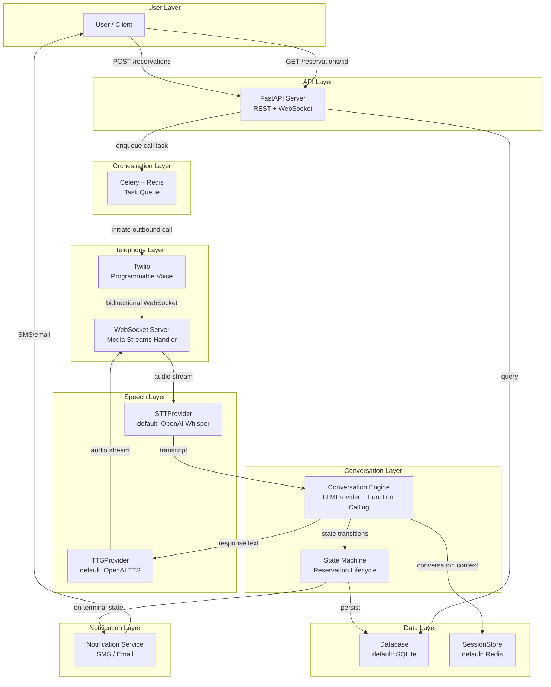
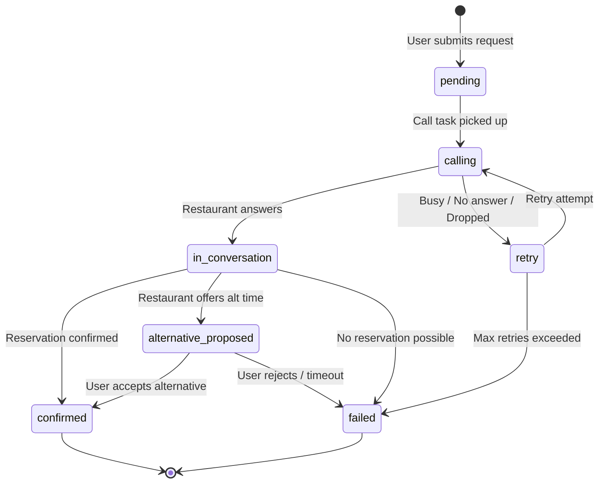

# Restaurant Reservation Agent — Architecture Design

## Problem Statement

Build an AI agent that:
1. Accepts reservation requests from users (restaurant name, phone, date, time, party size, flexibility)
2. Places outbound phone calls to restaurants and conducts natural voice conversations to book tables
3. Negotiates alternative times within user-defined bounds when the preferred slot is unavailable
4. Notifies users of outcomes (confirmed, alternative proposed, failed)

---

## Design Decisions & Rationale

### Decision 1: Chained Pipeline (STT → LLM → TTS) over WebSocket Media Streams

> [!IMPORTANT]
> We use the **chained pipeline** (STT → LLM → TTS) delivered over **Twilio bidirectional Media Streams** (WebSockets). We do NOT use the older `<Gather>` webhook-per-turn model or the newer GPT-4o Realtime speech-to-speech API.

**Alternatives considered:**

| Aspect | Chained Pipeline (ASR → LLM → TTS) | Speech-to-Speech (GPT-4o Realtime) | `<Gather>` Webhook Model |
|--------|-------------------------------------|-------------------------------------|--------------------------|
| Latency | ~1.5-3s per turn | ~0.5-1s per turn | ~3-5s per turn (HTTP round-trip) |
| Control | Full — transcript available, function calling on text | Limited — audio in/out, less inspectable | Full but slow — one webhook per utterance |
| Cost | Lower (separate cheaper models) | Higher (single expensive model) | Lowest but worst UX |
| Debuggability | High — text transcript at every stage | Low — opaque audio pipeline | High but fragmented |
| Transcript logging | Built-in (text is the primary medium) | Requires separate transcription | Built-in via `SpeechResult` |
| Maturity | Production-proven | Still evolving | Legacy, being deprecated |
| Negotiation logic | Precise — structured function calls on text | Harder to constrain | Precise but slow |
| Real-time feel | Good — WebSocket enables sub-second audio | Best — native audio model | Poor — noticeable HTTP gaps |

**Why chained pipeline wins:**

1. **Transcript visibility is non-negotiable.** The agent acts on the user's behalf. Every word said must be logged and auditable. The chained pipeline produces text as its primary medium — transcripts are a natural byproduct, not an afterthought.

2. **Function calling precision matters for negotiation.** When the restaurant says "we can do 8:15 instead," the LLM must produce a structured `propose_alternative(time="20:15")` call — not a free-form audio response. Function calling on text is mature, well-documented, and testable. Function calling on audio (GPT-4o Realtime) is still experimental and harder to constrain.

3. **Debuggability saves development time.** When something goes wrong in a phone call, we need to answer: "What did the restaurant say? What did the LLM decide? Why?" With a chained pipeline, every stage has inspectable text output. With speech-to-speech, we'd have to reverse-engineer from audio.

4. **Cost predictability.** GPT-4o Realtime pricing is significantly higher and less predictable (charged per audio minute, not per token). For a system that may make many calls per day, cost control matters.

**Why NOT `<Gather>` webhooks:**

The older `<Gather>` model requires a full HTTP round-trip per utterance. Twilio sends a webhook with `SpeechResult`, waits for a TwiML response, then plays it back. This adds 3-5s of perceived latency per turn — unacceptable for natural conversation. Restaurant staff will assume the line is dead and hang up.

**Why WebSocket Media Streams:**

`<Connect><Stream>` opens a persistent bidirectional WebSocket between Twilio and our server. Audio flows continuously in both directions. This eliminates the HTTP round-trip latency of `<Gather>` while keeping full control over the pipeline. It's the best of both worlds: real-time audio + inspectable text at every stage.

---

### Decision 2: All-OpenAI Default Providers

> [!IMPORTANT]
> Default providers are all-OpenAI: Whisper (STT) + GPT-4o (LLM) + TTS. Single SDK, single API key, single billing account.

**Alternatives considered:**

| Component | Option A (Chosen) | Option B | Option C |
|-----------|-------------------|----------|----------|
| STT | OpenAI Whisper API | Deepgram Nova-2 | faster-whisper (on-device) |
| TTS | OpenAI TTS API | ElevenLabs Turbo v2.5 | Kokoro (on-device) |
| LLM | OpenAI GPT-4o | Anthropic Claude | Local LLM |

**Why all-OpenAI:**

1. **Minimal dependency surface.** One SDK (`openai`), one API key, one billing dashboard, one set of rate limits to understand. Adding Deepgram for STT and ElevenLabs for TTS would mean 3 SDKs, 3 API keys, 3 billing accounts, 3 sets of documentation, 3 points of failure.

2. **Reduced operational complexity.** When debugging a failed call: "Was it the Deepgram connection? The ElevenLabs rate limit? The OpenAI timeout?" becomes "Was it the OpenAI API?" One provider to monitor, one set of status pages to check.

3. **Good enough quality.** Whisper is excellent for STT (state-of-the-art accuracy). OpenAI TTS is decent (not as natural as ElevenLabs, but sufficient for a professional booking call). GPT-4o is best-in-class for function calling.

4. **Cost consolidation.** Single invoice. Easier to track, budget, and optimize.

**Why not best-in-class per component:**

Deepgram Nova-2 is better for phone audio (native 8kHz µ-law support, no resampling). ElevenLabs sounds more natural. But the complexity cost of 3 providers outweighs the marginal quality improvement for an MVP. The provider abstraction lets us swap later if quality issues surface.

**Why not on-device:**

faster-whisper + Kokoro would eliminate all cloud dependencies (except LLM). But they require a GPU, add 2GB+ of model dependencies, need warm-up time, and introduce audio resampling complexity (8kHz µ-law → 16kHz PCM for Whisper). Operational burden is significantly higher. Again — swappable later via provider abstraction.

---

### Decision 3: Provider Abstraction for All External Dependencies

> [!IMPORTANT]
> **Every external dependency is abstracted behind a provider interface.** Default providers can be swapped without touching business logic. This is a core architectural constraint, not an optional pattern.

**Why this matters:**

1. **Future-proofing.** AI models and APIs evolve fast. A better STT provider may emerge next month. Swapping should be a config change, not a refactor.

2. **Testing.** Mock providers enable unit testing without API calls, network dependencies, or credentials. The `ConversationEngine` can be tested with a mock `LLMProvider` that returns deterministic responses.

3. **Cost optimization.** Start with cloud OpenAI, move to on-device models later to eliminate per-call API costs. The business logic doesn't change.

4. **Environment flexibility.** Development: mock providers (fast, free). Staging: OpenAI (real but cheap). Production: potentially mixed (Deepgram STT for accuracy, OpenAI LLM, ElevenLabs TTS for voice quality).

**Swappable components:**

| Component | Interface | Default Provider | Swappable To |
|-----------|-----------|-----------------|--------------|
| STT | `STTProvider` | OpenAI Whisper API | Deepgram, faster-whisper (on-device) |
| TTS | `TTSProvider` | OpenAI TTS API | ElevenLabs, Kokoro (on-device) |
| LLM | `LLMProvider` | OpenAI GPT-4o | Anthropic Claude, local LLM |
| Session Store | `SessionStore` | Redis | In-memory dict, SQLite |
| Database | `Database` | SQLite | PostgreSQL, Redis |

### Provider Interface Pattern

```python
# Abstract base — all providers follow this pattern
from abc import ABC, abstractmethod

class STTProvider(ABC):
    @abstractmethod
    async def create_stream(self) -> STTStream: ...

class STTStream(ABC):
    @abstractmethod
    async def send_audio(self, chunk: bytes) -> TranscriptResult | None: ...
    @abstractmethod
    async def close(self) -> None: ...

class TTSProvider(ABC):
    @abstractmethod
    async def synthesize(self, text: str) -> AsyncIterator[bytes]: ...

class LLMProvider(ABC):
    @abstractmethod
    async def chat(self, messages: list[dict], functions: list[dict] | None = None) -> LLMResponse: ...

class SessionStore(ABC):
    @abstractmethod
    async def get(self, key: str) -> dict | None: ...
    @abstractmethod
    async def set(self, key: str, value: dict, ttl: int | None = None) -> None: ...
    @abstractmethod
    async def delete(self, key: str) -> None: ...

class Database(ABC):
    @abstractmethod
    async def create_reservation(self, reservation: Reservation) -> None: ...
    @abstractmethod
    async def get_reservation(self, reservation_id: str) -> Reservation | None: ...
    @abstractmethod
    async def update_reservation(self, reservation_id: str, **fields) -> None: ...
    @abstractmethod
    async def log_state_transition(self, transition: StateTransition) -> None: ...
    @abstractmethod
    async def log_call(self, call_log: CallLog) -> None: ...
```

### Provider Registration

```python
# configs/providers.py — single place to swap providers
from src.providers.openai_stt import OpenAISTT
from src.providers.openai_tts import OpenAITTS
from src.providers.openai_llm import OpenAILLM
from src.providers.redis_session import RedisSessionStore
from src.providers.sqlite_db import SQLiteDatabase

def create_providers() -> dict:
    return {
        "stt": OpenAISTT(),
        "tts": OpenAITTS(),
        "llm": OpenAILLM(),
        "session": RedisSessionStore(),
        "db": SQLiteDatabase(),
    }
```

---

### Decision 4: Redis + SQLite (Dual Data Store)

**Why not just one?**

Redis and SQLite serve fundamentally different purposes:

| Concern | Redis | SQLite |
|---------|-------|--------|
| Data type | Ephemeral, fast-access | Durable, structured |
| Durability | In-memory (AOF/RDB possible but not primary) | ACID-compliant file on disk |
| Query model | Key-value lookup | Full SQL |
| Use case | Live session state, distributed locks, task broker | Reservation records, transcripts, audit logs |
| Loss impact | Low — sessions die when calls end | Critical — user's confirmed booking |

**Why Redis:**
- Celery needs a message broker — Redis is the standard choice
- Live call sessions need sub-millisecond reads (conversation context grows with each turn)
- Distributed locks prevent concurrent state transitions on the same reservation
- TTL-based expiry cleans up dead sessions automatically

**Why SQLite:**
- Reservation records are permanent business data — ACID durability is essential
- Transcripts are legal/audit artifacts — cannot be lost to a Redis restart
- State transition logs need structured queries for debugging ("show me all transitions for reservation X")
- Zero operational overhead — no server, no config, single file, built into Python

**Why not Redis-only:**
- Redis persistence (AOF/RDB) is a bolt-on, not a core guarantee. Power failure can lose recent writes.
- No SQL means no complex queries for reporting, debugging, or audit.
- Keeping all data in RAM is wasteful for cold data (old transcripts, completed reservations).

**Why not SQLite-only:**
- SQLite is single-writer — concurrent Celery workers would contend on the write lock.
- No native TTL — expired sessions would require manual cleanup jobs.
- Higher latency for the hot-path reads needed during live calls.

---

### Decision 5: LLM Function Calling for Structured Decisions

**Why not free-form text responses?**

The LLM must make structured decisions during the call: confirm a time, propose an alternative, request a hold, or end the call. Free-form text responses would require parsing and regex extraction of times, dates, and intents — fragile and error-prone.

Function calling forces the LLM to output structured JSON with validated fields. The server can then enforce constraints (e.g., `proposed_time` must be within user's flexibility window) before acting.

**Why these specific functions:**

```python
RESERVATION_FUNCTIONS = [
    "confirm_reservation"    # Happy path: restaurant confirms
    "propose_alternative"    # Negotiation: restaurant offers different time
    "request_hold"           # Pause: restaurant needs to check availability
    "end_call"               # Terminal: no reservation possible
]
```

These four functions cover the complete decision space for a reservation call:
- Every natural conversation turn maps to exactly one of these actions
- There is no "ambiguous" state — the LLM must commit to a structured action
- Server-side validation can reject invalid actions (e.g., `propose_alternative` with a time outside bounds)
- The state machine knows exactly what happened and can transition accordingly

---

## System Architecture



---

## Component Breakdown

### 1. API Layer (`src/api/`)

**Purpose:** User-facing REST API for reservation management.

| Method | Path | Description |
|--------|------|-------------|
| `POST` | `/reservations` | Submit new reservation request |
| `GET` | `/reservations/{id}` | Check reservation status |
| `GET` | `/reservations/{id}/transcript` | Retrieve call transcript |
| `POST` | `/reservations/{id}/confirm-alternative` | User confirms proposed alternative |
| `POST` | `/reservations/{id}/cancel` | Cancel pending reservation |
| `POST` | `/webhooks/twilio/status` | Twilio call status callback |
| `WebSocket` | `/ws/media-stream/{call_sid}` | Twilio bidirectional media stream |

#### Key schemas

```python
class ReservationRequest(BaseModel):
    restaurant_name: str
    restaurant_phone: str           # E.164 format
    date: date                      # Must be future
    preferred_time: time
    alt_time_window: tuple[time, time] | None  # Negotiation bounds
    party_size: int                 # 1-20
    special_requests: str | None
    user_contact: UserContact       # phone + email for notifications

class ReservationResponse(BaseModel):
    reservation_id: UUID
    status: ReservationStatus
    confirmed_time: time | None
    call_attempts: int
    transcript: str | None
```

---

### 2. Orchestration Layer (`src/tasks/`)

**Purpose:** Async call execution with retry logic.

```python
@celery_app.task(bind=True, max_retries=3, default_retry_delay=60)
def place_reservation_call(self, reservation_id: str):
    """
    1. Load reservation from DB
    2. Validate still in 'pending' or 'retry' state
    3. Initiate Twilio outbound call with Media Stream URL
    4. Update state to 'calling'
    5. On failure/timeout → retry with exponential backoff
    """
```

**Retry policy:**
- Attempt 1: immediate
- Attempt 2: after 60s
- Attempt 3: after 120s
- After 3 failures: set status to `failed`, notify user

**Why exponential backoff:** Restaurants may be briefly busy. Hammering them with immediate retries is rude and unlikely to succeed. 60s → 120s gives time for lines to clear.

**Why max 3 attempts:** Diminishing returns. If a restaurant doesn't answer 3 times, they're likely closed, too busy, or the number is wrong. Better to notify the user and let them decide.

---

### 3. Telephony Layer (`src/telephony/`)

**Purpose:** Twilio integration — outbound calls, status callbacks, media stream management.

#### Call initiation flow

```python
def initiate_call(reservation: Reservation) -> str:
    """Returns Call SID"""
    call = twilio_client.calls.create(
        to=reservation.restaurant_phone,
        from_=TWILIO_PHONE_NUMBER,
        twiml=f'''
            <Response>
                <Connect>
                    <Stream url="wss://{HOST}/ws/media-stream/{reservation.reservation_id}"
                            statusCallbackUrl="{HOST}/webhooks/twilio/status" />
                </Connect>
            </Response>
        ''',
        status_callback=f"{HOST}/webhooks/twilio/status",
        status_callback_event=["initiated", "ringing", "answered", "completed"],
    )
    return call.sid
```

#### Media stream WebSocket handler

```python
async def handle_media_stream(websocket, reservation_id, providers):
    stt = await providers["stt"].create_stream()
    tts = providers["tts"]
    conversation = ConversationEngine(reservation_id, providers)

    async for message in websocket:
        event = json.loads(message)

        if event["event"] == "media":
            audio_chunk = base64.b64decode(event["media"]["payload"])
            transcript = await stt.send_audio(audio_chunk)

            if transcript and transcript.is_final:
                response = await conversation.process(transcript.text)
                async for audio_chunk in tts.synthesize(response.speech_text):
                    await websocket.send(json.dumps({
                        "event": "media",
                        "streamSid": stream_sid,
                        "media": {"payload": base64.b64encode(audio_chunk).decode()}
                    }))
                await conversation.handle_action(response)

        elif event["event"] == "stop":
            await stt.close()
            await conversation.finalize()
```

---

### 4. Conversation Engine (`src/conversation/`)

**Purpose:** LLM-driven dialogue management with structured decision-making.

#### LLM function calling schema

```python
RESERVATION_FUNCTIONS = [
    {
        "name": "confirm_reservation",
        "description": "Restaurant confirms the reservation at the requested or proposed time",
        "parameters": {
            "confirmed_time": {"type": "string", "description": "HH:MM format"},
            "confirmed_date": {"type": "string", "description": "YYYY-MM-DD"},
            "special_notes": {"type": "string", "description": "Any notes from restaurant"},
        }
    },
    {
        "name": "propose_alternative",
        "description": "Restaurant offers an alternative time. Only call if within user's flexibility window.",
        "parameters": {
            "proposed_time": {"type": "string", "description": "HH:MM format"},
            "reason": {"type": "string", "description": "Why original time unavailable"},
        }
    },
    {
        "name": "request_hold",
        "description": "Restaurant asks to hold or check availability. Agent should wait.",
        "parameters": {
            "hold_reason": {"type": "string"},
        }
    },
    {
        "name": "end_call",
        "description": "No reservation possible. End the call politely.",
        "parameters": {
            "reason": {"type": "string", "description": "Why booking failed"},
        }
    },
]
```

#### System prompt structure

```
You are a polite, professional booking assistant calling on behalf of {user_name}.
You are calling {restaurant_name} to make a reservation.

RESERVATION DETAILS:
- Date: {date}
- Preferred time: {preferred_time}
- Party size: {party_size}
- Special requests: {special_requests}

NEGOTIATION BOUNDS:
- You may accept alternative times between {alt_start} and {alt_end}
- You may NOT change the party size or date
- If no acceptable time is available, end the call politely

BEHAVIOR RULES:
- Identify yourself: "Hi, I'm calling to make a reservation on behalf of a guest."
- Be concise — restaurant staff are busy
- Always confirm details before ending: repeat date, time, party size, name
- If asked to hold, wait patiently (up to 30 seconds of silence)
- If transferred, re-introduce yourself
- If you reach voicemail, hang up (retry will be handled automatically)

DISCLOSURE (required): Mention that you are an automated booking assistant.
```

#### Conversation context management

- Maintain rolling transcript in Redis (via `SessionStore`), keyed by `call_sid`
- Context window: last 20 turns (or ~2000 tokens) — summarize older turns
- Each turn: `{ role: "restaurant" | "agent", text: str, timestamp: float }`

---

### 5. State Machine (`src/conversation/state_machine.py`)



**Transition rules:**
- All transitions are atomic (DB write in single transaction)
- Invalid transitions raise `InvalidStateTransition` exception
- Every transition logs: `from_state`, `to_state`, `trigger`, `timestamp`, `call_sid`
- Terminal states (`confirmed`, `failed`) trigger notification

**Why `alternative_proposed` is a separate state:**
When the restaurant offers an alternative time, we need user consent before confirming. The agent cannot accept on the user's behalf beyond their stated flexibility window. This state parks the reservation until the user responds (via SMS/email confirmation).

---

### 6. Notification Layer (`src/notifications/`)

**Purpose:** Notify user of reservation outcomes.

| Event | Channel | Content |
|-------|---------|---------|
| Confirmed | SMS + Email | "Your reservation at {restaurant} is confirmed for {date} at {time}, party of {size}." |
| Alternative proposed | SMS + Email | "Alternative offered: {date} at {alt_time}. Reply CONFIRM or REJECT." |
| Failed | SMS + Email | "Unable to book at {restaurant}. Reason: {reason}. Transcript available at {link}." |
| Max retries | SMS + Email | "Could not reach {restaurant} after 3 attempts." |

---

## Data Layer

### SQLite Schema

```sql
CREATE TABLE reservations (
    reservation_id TEXT PRIMARY KEY,
    user_id TEXT NOT NULL,
    restaurant_name TEXT NOT NULL,
    restaurant_phone TEXT NOT NULL,
    date TEXT NOT NULL,
    preferred_time TEXT NOT NULL,
    alt_time_start TEXT,
    alt_time_end TEXT,
    party_size INTEGER NOT NULL CHECK(party_size BETWEEN 1 AND 20),
    special_requests TEXT,
    status TEXT NOT NULL DEFAULT 'pending',
    call_attempts INTEGER NOT NULL DEFAULT 0,
    call_sid TEXT,
    confirmed_time TEXT,
    transcript TEXT,
    created_at TEXT NOT NULL,
    updated_at TEXT NOT NULL
);

CREATE TABLE call_logs (
    id INTEGER PRIMARY KEY AUTOINCREMENT,
    reservation_id TEXT NOT NULL REFERENCES reservations(reservation_id),
    call_sid TEXT NOT NULL,
    attempt_number INTEGER NOT NULL,
    status TEXT NOT NULL,
    duration_seconds INTEGER,
    started_at TEXT NOT NULL,
    ended_at TEXT,
    error_message TEXT
);

CREATE TABLE state_transitions (
    id INTEGER PRIMARY KEY AUTOINCREMENT,
    reservation_id TEXT NOT NULL REFERENCES reservations(reservation_id),
    from_state TEXT NOT NULL,
    to_state TEXT NOT NULL,
    trigger TEXT NOT NULL,
    call_sid TEXT,
    timestamp TEXT NOT NULL
);
```

### Redis Keys

| Key Pattern | TTL | Purpose |
|-------------|-----|---------|
| `session:{call_sid}` | 10 min | Active call conversation context |
| `reservation:{id}:lock` | 30 sec | Prevent concurrent state transitions |

---

## Project File Map

```
reservation-agent/
├── configs/
│   ├── providers.py       # Provider registration — swap providers here
│   ├── telephony.py       # Twilio creds, phone number, timeouts
│   └── app.py             # FastAPI, Redis URL, retry policy
├── src/
│   ├── providers/         # Provider interface + implementations
│   │   ├── base.py        # Abstract interfaces (STTProvider, TTSProvider, etc.)
│   │   ├── openai_stt.py  # OpenAI Whisper STT implementation
│   │   ├── openai_tts.py  # OpenAI TTS implementation
│   │   ├── openai_llm.py  # OpenAI GPT-4o LLM implementation
│   │   ├── redis_session.py   # Redis session store implementation
│   │   └── sqlite_db.py       # SQLite database implementation
│   ├── api/
│   │   ├── routes.py      # REST endpoints + WebSocket media stream
│   │   └── schemas.py     # Pydantic request/response models
│   ├── telephony/
│   │   ├── caller.py      # Twilio outbound call initiation
│   │   ├── media_stream.py # WebSocket handler for bidirectional audio
│   │   └── callbacks.py   # Status callback handler
│   ├── conversation/
│   │   ├── engine.py      # LLM conversation engine + function calling
│   │   ├── prompts.py     # System prompt templates
│   │   └── state_machine.py # Reservation lifecycle states
│   ├── notifications/
│   │   └── notifier.py    # SMS + email dispatch
│   ├── models/
│   │   ├── reservation.py # Reservation model
│   │   ├── call_log.py    # Call log model
│   │   └── enums.py       # ReservationStatus, CallStatus enums
│   ├── tasks/
│   │   └── call_task.py   # Celery task for async call orchestration
│   └── db/
│       └── migrations/    # Schema versioning
├── tests/
│   ├── unit/
│   ├── integration/
│   └── e2e/
├── scripts/
│   ├── run_server.py
│   └── simulate_call.py   # Local call simulation without Twilio
└── requirements.txt
```

---

## Key Risk Mitigations

| Risk | Severity | Mitigation |
|------|----------|------------|
| LLM agrees outside negotiation bounds | High | Function calling constrains output; `propose_alternative` validates against `alt_time_window` server-side before accepting |
| STT misrecognizes time | High | Confirmation loop in prompt; parsed time validated against bounds |
| Call drops mid-conversation | Medium | `stop` event on WebSocket triggers graceful state save; retry picks up from last known state |
| Concurrent events race on state | Medium | Redis lock on reservation ID with 30s TTL |
| LLM latency > 2s (awkward silence) | Medium | Pre-generated filler phrases; TTS streaming starts before full response generated |
| Twilio webhook replay/duplicate | Low | Idempotency via `call_sid` + event sequence dedup |
| Credential leak | High | All secrets via env vars; structlog filters sensitive fields |

---

## Implementation Roadmap

| Phase | Milestone | What to Build | Dependencies |
|-------|-----------|---------------|-------------|
| 1 | M1: Foundation | Provider interfaces, DB schema, models, enums, REST API (create + get), configs | None |
| 2 | M2: Telephony | Twilio caller, WebSocket media stream handler, status callbacks | M1 |
| 3 | M3: Conversation | OpenAI STT/TTS/LLM providers, conversation engine, prompts, state machine | M1, M2 |
| 4 | M4: Negotiation | Function calling, alt-time validation, confirmation loops, user notification of alternatives | M3 |
| 5 | M5: Resilience | Celery retry logic, error handling, transcript persistence, call logging | M2, M3 |
| 6 | M6: Polish | E2E test suite, call simulator, monitoring, deployment config | All |

---

## Verification Plan

### Automated Tests

Each milestone includes unit + integration tests:

```bash
# Run all tests
pytest tests/ -v

# Run with coverage
pytest tests/ --cov=src --cov-report=term-missing

# Run specific test module
pytest tests/unit/test_state_machine.py -v
```

### Call Simulation (scripts/simulate_call.py)

Mock Twilio + restaurant responses locally:
- Simulates WebSocket connection with pre-recorded audio
- Tests full pipeline: STT → LLM → TTS → state transitions
- Validates transcript logging and notification dispatch

### Manual Verification

After M3+ is complete:
1. Start server locally with ngrok for Twilio webhooks
2. Submit reservation via API
3. Observe call placed to a test phone number
4. Verify conversation flow, transcript, and state transitions
5. Check notification delivery
