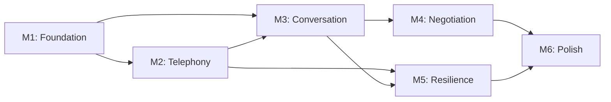

# Restaurant Reservation Agent — Phased Implementation Plan

> Reference: [Architecture Design](file:///home/etem/reservation-agent/Implementation%20Plan/architecture_design.md) for design decisions, system architecture, and component specifications.

## Dependency Graph



---

## Phase 1 — M1: Foundation

**Goal:** Establish the project skeleton — provider interfaces, data models, database, REST API, and configs. No external API calls yet; everything works with mocks.

### Files to Create

| File | What It Does |
|------|-------------|
| `requirements.txt` | Pinned dependencies (fastapi, openai, twilio, celery, redis, etc.) |
| `configs/app.py` | FastAPI settings, Redis URL, retry policy, rate limit config |
| `configs/telephony.py` | Twilio credentials (env vars), phone number, ring/call timeouts |
| `configs/providers.py` | Provider registration — instantiate and return all provider implementations |
| `src/providers/base.py` | Abstract interfaces: `STTProvider`, `TTSProvider`, `LLMProvider`, `SessionStore`, `Database` |
| `src/models/enums.py` | `ReservationStatus`, `CallStatus` enums |
| `src/models/reservation.py` | `Reservation` data class |
| `src/models/call_log.py` | `CallLog` data class |
| `src/models/transcript.py` | `TranscriptTurn` data class |
| `src/db/migrations/001_init.sql` | SQLite schema: `reservations`, `transcript_turns`, `call_logs`, `state_transitions`, `transcript_view` |
| `src/providers/sqlite_db.py` | `SQLiteDatabase` — implements `Database` interface |
| `src/providers/redis_session.py` | `RedisSessionStore` — implements `SessionStore` interface |
| `src/api/schemas.py` | Pydantic models: `ReservationRequest`, `ReservationResponse`, `TimeWindow`, `UserContact` |
| `src/api/routes.py` | REST endpoints: `POST /reservations`, `GET /reservations/{id}`, `GET /reservations/{id}/transcript`, `POST /reservations/{id}/cancel`, `GET /health` |
| `src/api/middleware.py` | Rate limiting middleware |

### Tests

| Test File | What It Validates |
|-----------|------------------|
| `tests/unit/test_models.py` | Enum values, model construction, field validation |
| `tests/unit/test_schemas.py` | Pydantic schema validation: E.164 phone, future date, party size 1-20, `TimeWindow` range, `None` alt handling |
| `tests/unit/test_sqlite_db.py` | CRUD operations: create reservation, get by ID, update status, log state transition, append transcript turn |
| `tests/integration/test_api.py` | Full HTTP round-trip: create reservation → verify `pending` → get by ID → cancel → verify `failed` |

### Acceptance Criteria

- [ ] `pytest tests/unit/ tests/integration/test_api.py` passes with 0 failures
- [ ] `POST /reservations` with valid payload returns `201` + `reservation_id`
- [ ] `POST /reservations` with invalid payload (past date, party_size=0, bad phone) returns `422`
- [ ] `GET /health` returns `200`
- [ ] Rate limiting rejects >5 `POST /reservations` in 1 minute
- [ ] SQLite schema created correctly via migration
- [ ] Provider interfaces importable and mockable (`AsyncMock(spec=STTProvider)` works)

---

## Phase 2 — M2: Telephony

**Goal:** Twilio integration — place outbound calls, handle WebSocket media streams, process audio through codec and VAD. No conversation engine yet; audio pipeline is testable in isolation.

**Depends on:** M1 (models, configs, DB, SessionStore)

### Files to Create

| File | What It Does |
|------|-------------|
| `src/telephony/audio_codec.py` | `AudioCodec` — µ-law ↔ PCM conversion, 8kHz ↔ 16kHz resampling |
| `src/telephony/vad.py` | `VADProcessor` — buffers audio chunks, detects end-of-speech, yields complete utterances |
| `src/telephony/silence.py` | `SilenceDetector` — monitors for prolonged silence (hold) and timeout |
| `src/telephony/caller.py` | `initiate_call()` — TwiML via SDK, voicemail detection, auth token generation, `time_limit=300` |
| `src/telephony/media_stream.py` | `handle_media_stream()` — WebSocket handler: auth token validation, codec, VAD pipeline, silence monitoring, call timeout watchdog |
| `src/telephony/callbacks.py` | Status callback handler with Twilio signature validation |

### Files to Modify

| File | What Changes |
|------|-------------|
| `src/api/routes.py` | Add `WebSocket /ws/media-stream/{reservation_id}`, `POST /webhooks/twilio/status` |
| `src/api/middleware.py` | Add Twilio signature validation for webhook endpoints |

### Tests

| Test File | What It Validates |
|-----------|------------------|
| `tests/unit/test_audio_codec.py` | µ-law → PCM → µ-law round-trip fidelity; 8kHz → 16kHz → 8kHz resampling |
| `tests/unit/test_vad.py` | Silence detection threshold; minimum speech duration; utterance boundary accuracy with synthetic audio |
| `tests/unit/test_silence.py` | 30s silence → `prompt_check`; 120s → `timeout`; speech resets timer |
| `tests/unit/test_caller.py` | TwiML generation contains `<Connect><Stream>`; auth token stored in Redis; `time_limit=300`; `machine_detection=Enable` |
| `tests/unit/test_callbacks.py` | Status callback updates call log; duplicate callbacks are idempotent; invalid signature returns `403` |
| `tests/integration/test_websocket.py` | WebSocket: valid token → accepted; invalid token → `4001` close; token consumed after use |

### Acceptance Criteria

- [ ] `pytest tests/unit/test_audio_codec.py tests/unit/test_vad.py tests/unit/test_silence.py tests/unit/test_caller.py tests/unit/test_callbacks.py tests/integration/test_websocket.py` passes
- [ ] `initiate_call()` produces valid TwiML with `<Connect><Stream>` and auth token
- [ ] WebSocket rejects connections with missing or invalid token
- [ ] Audio codec round-trip (µ-law → PCM → µ-law) produces equivalent output
- [ ] VAD correctly segments a 5-second speech + 1-second silence test signal
- [ ] Silence detector fires `prompt_check` at 30s and `timeout` at 120s
- [ ] Twilio status callback with invalid signature returns `403`

---

## Phase 3 — M3: Conversation

**Goal:** Wire up the full conversation pipeline — STT, LLM, TTS through provider implementations, conversation engine with function calling, state machine, and greeting flow.

**Depends on:** M1 (interfaces, DB), M2 (codec, VAD, WebSocket handler)

### Files to Create

| File | What It Does |
|------|-------------|
| `src/providers/openai_stt.py` | `OpenAISTT` — implements `STTProvider.transcribe()` using `client.audio.transcriptions.create()` |
| `src/providers/openai_tts.py` | `OpenAITTS` — implements `TTSProvider.synthesize()` using `client.audio.speech.create()` with streaming |
| `src/providers/openai_llm.py` | `OpenAILLM` — implements `LLMProvider.chat()` using `client.chat.completions.create()` with function calling |
| `src/conversation/prompts.py` | System prompt template with reservation details, negotiation bounds, behavior rules |
| `src/conversation/engine.py` | `ConversationEngine` — manages messages list, calls LLM, handles function call responses, greeting generation |
| `src/conversation/state_machine.py` | `StateMachine` — enforces valid transitions, logs every transition, triggers notifications on terminal states |
| `src/conversation/validators.py` | `parse_time_strict()`, `parse_date_strict()`, `validate_proposed_time()`, `validate_confirmed_date()` |

### Files to Modify

| File | What Changes |
|------|-------------|
| `src/telephony/media_stream.py` | Wire VAD output → STT → ConversationEngine → TTS → codec → WebSocket; add greeting on `start` event |
| `configs/providers.py` | Register `OpenAISTT`, `OpenAITTS`, `OpenAILLM` as default providers |

### Tests

| Test File | What It Validates |
|-----------|------------------|
| `tests/unit/test_validators.py` | `parse_time_strict("19:30")` → `time(19,30)`; `"7:30 PM"` → `ValueError`; bounds checking |
| `tests/unit/test_state_machine.py` | All valid transitions succeed; invalid transitions raise `InvalidStateTransition`; every transition logged |
| `tests/unit/test_conversation_engine.py` | Mock LLM: confirm action → state transition; propose alt → validation → state transition; invalid time → re-prompt; greeting generation |
| `tests/unit/test_prompts.py` | Prompt template renders with all fields; handles `None` alt_time_window; negotiation bounds section omitted when no flexibility |
| `tests/integration/test_providers.py` | (Requires OpenAI API key) STT transcribes a sample WAV; TTS produces audio for "Hello"; LLM returns a function call for a mock conversation turn |

### Acceptance Criteria

- [ ] Unit tests pass with mocked providers (no API keys needed)
- [ ] State machine correctly rejects `confirmed → calling` transition
- [ ] Validator rejects `"7:30 PM"`, accepts `"19:30"`
- [ ] Validator rejects proposed time outside `TimeWindow`
- [ ] ConversationEngine with mock LLM produces correct state transitions for confirm/propose/hold/end scenarios
- [ ] Greeting is generated on `start` event, before any restaurant speech
- [ ] Integration tests pass with real OpenAI API (optional, requires API key)

---

## Phase 4 — M4: Negotiation

**Goal:** Complete the negotiation loop — function calling drives structured decisions, server-side validation enforces bounds, alternatives require user consent, notifications inform users.

**Depends on:** M3 (conversation engine, state machine, validators)

### Files to Create

| File | What It Does |
|------|-------------|
| `src/notifications/notifier.py` | `notify_user()` — dispatches SMS (Twilio) and email (SMTP) for confirmed, failed, alternative, timeout events |

### Files to Modify

| File | What Changes |
|------|-------------|
| `src/conversation/engine.py` | Wire validation layer into `handle_action()`: validate → accept/re-prompt → state transition |
| `src/conversation/state_machine.py` | Trigger `notifier.notify_user()` on terminal states; handle `alternative_proposed` → user confirm/reject |
| `src/api/routes.py` | Add `POST /reservations/{id}/confirm-alternative` endpoint |

### Tests

| Test File | What It Validates |
|-----------|------------------|
| `tests/unit/test_negotiation.py` | Alt time within bounds → `alternative_proposed`; alt time outside bounds → re-prompt → `end_call`; user confirms alt → `confirmed` |
| `tests/unit/test_notifier.py` | Mock SMS/email dispatch; correct message template per event type; notification fired on terminal states only |
| `tests/integration/test_confirm_alt.py` | Full flow: reservation → `alternative_proposed` → `POST /confirm-alternative` → `confirmed` → notification |

### Acceptance Criteria

- [ ] Restaurant proposes time within bounds → `alternative_proposed` + user notified
- [ ] Restaurant proposes time outside bounds → LLM re-prompted → declines politely
- [ ] User confirms alternative → `confirmed` + confirmation notification
- [ ] User rejects alternative → `failed` + failure notification
- [ ] Notification dispatched (mocked) for every terminal state transition
- [ ] LLM cannot produce a state transition without passing validation

---

## Phase 5 — M5: Resilience

**Goal:** Production hardening — retry logic, stale state cleanup, transcript durability, call logging, readiness checks.

**Depends on:** M2 (telephony), M3 (conversation)

### Files to Create

| File | What It Does |
|------|-------------|
| `src/tasks/call_task.py` | `place_reservation_call` Celery task — load reservation, validate state, initiate call, handle retries with exponential backoff |
| `src/tasks/cleanup_task.py` | Celery Beat tasks: `cleanup_stale_reservations()` (10min calling timeout, 24h alt timeout), `flush_transcripts()` |
| `scripts/run_server.py` | Launches all 3 processes: FastAPI (uvicorn), Celery Worker, Celery Beat |

### Files to Modify

| File | What Changes |
|------|-------------|
| `src/api/routes.py` | Add `GET /readiness` (checks Redis + Twilio connectivity) |
| `src/conversation/engine.py` | Add `finalize()` method: persist transcript to SQLite on call end; dual-write each turn (Redis + SQLite) |
| `src/telephony/media_stream.py` | Ensure `finally` block always calls `conversation.finalize()` regardless of error/timeout |

### Tests

| Test File | What It Validates |
|-----------|------------------|
| `tests/unit/test_call_task.py` | Task retries on failure; max 3 attempts; exponential backoff timing; `failed` state after max retries |
| `tests/unit/test_cleanup_task.py` | `calling` >10min → `retry`/`failed`; `alternative_proposed` >24h → `failed` + notification |
| `tests/unit/test_transcript_persist.py` | Transcript dual-written on every turn; transcript persisted on `finalize()`; no data loss when Redis is flushed |
| `tests/integration/test_readiness.py` | `/readiness` returns `200` when Redis up; `503` when Redis down |

### Acceptance Criteria

- [ ] Celery task retries 3 times with increasing delay, then sets `failed`
- [ ] `scripts/run_server.py` starts FastAPI, Celery Worker, and Celery Beat
- [ ] Stale `calling` reservations auto-transition after 10 minutes
- [ ] Stale `alternative_proposed` reservations auto-fail after 24 hours
- [ ] Transcript survives Redis restart (SQLite has the durable copy)
- [ ] `GET /readiness` returns `503` when Redis is unreachable
- [ ] Every call produces a `call_logs` entry regardless of outcome

---

## Phase 6 — M6: Polish

**Goal:** End-to-end validation, call simulation tooling, and production packaging.

**Depends on:** All previous milestones

### Files to Create

| File | What It Does |
|------|-------------|
| `scripts/simulate_call.py` | Local call simulator: fake WebSocket + pre-scripted restaurant responses, runs full pipeline without Twilio |
| `tests/e2e/test_scenarios.py` | 10 defined E2E test scenarios |

### Files to Modify

| File | What Changes |
|------|-------------|
| `configs/app.py` | Add monitoring/logging config (structlog format, log level) |

### E2E Test Scenarios

| # | Scenario | Flow | Expected Outcome |
|---|----------|------|-----------------|
| 1 | Happy path | API → call → restaurant confirms | `confirmed` + notification |
| 2 | Negotiation accepted | API → call → restaurant proposes alt within bounds → user confirms | `confirmed` |
| 3 | Rejection | API → call → restaurant has no availability | `failed` + notification |
| 4 | Retry on busy | API → call → busy → retry → restaurant answers → confirms | `confirmed` after 2 attempts |
| 5 | Voicemail | API → call → voicemail detected → hang up → retry | `calling` on attempt 2 |
| 6 | Hold handling | API → call → "please hold" → 30s silence → agent prompts → resume → confirms | `confirmed` |
| 7 | Max retries | API → call → no answer × 3 | `failed` + "could not reach" notification |
| 8 | Call timeout | API → call → conversation > 5 min | forced `end_call` → `failed` |
| 9 | Alt timeout | API → call → alt proposed → no user response for 24h | `failed` + "offer expired" notification |
| 10 | Concurrent | Two reservations submitted simultaneously | Both complete without state corruption |

### Acceptance Criteria

- [ ] All 10 E2E scenarios pass with simulated Twilio
- [ ] `scripts/simulate_call.py` runs a full booking end-to-end without network
- [ ] `pytest tests/ --cov=src` reports ≥80% coverage
- [ ] `scripts/run_server.py` starts cleanly, handles `SIGTERM` with graceful shutdown
- [ ] Structured logs include `reservation_id`, `call_sid`, state transitions — no credentials leaked

---

## Verification Plan

### Automated Tests

Each milestone includes unit + integration tests:

```bash
# Run all tests
pytest tests/ -v

# Run with coverage
pytest tests/ --cov=src --cov-report=term-missing

# Run specific test module
pytest tests/unit/test_state_machine.py -v
```

### Call Simulation (`scripts/simulate_call.py`)

Mock Twilio + restaurant responses locally:
- Simulates WebSocket connection with pre-recorded audio
- Tests full pipeline: VAD → STT → LLM → TTS → codec → state transitions
- Validates transcript logging and notification dispatch

### Manual Verification

After M3+ is complete:
1. Start server locally with ngrok for Twilio webhooks
2. Submit reservation via API
3. Observe call placed to a test phone number
4. Verify conversation flow, transcript, and state transitions
5. Check notification delivery
